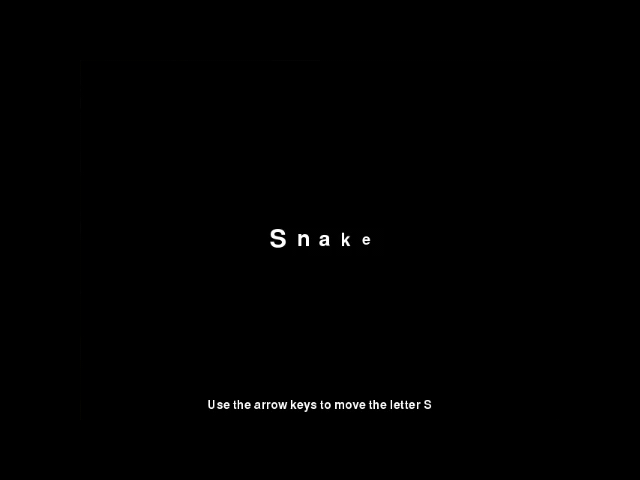

# Snake for Pygame Zero

This project creates a display where letters follow one another around a window. It is a development from the project called [LetterA](https://github.com/WokLibCodeClub/LetterA), and if you haven't done the LetterA project you might think about doing that before continuing with this Snake project.

You can see how this works in the animation - as you press the arrow keys the chain of letters moves around the screen, like a snake.

The programme runs with Pygame Zero, like the LetterA project, but in order to understand how it works we will need to explore lists, loops and the range function using normal Python.

Along the way there will be challenges. You may be able to find possible solutions to these challenges by looking at code from the following step, but you'll learn much more about Python coding if you try to solve the challenges yourself first.

[Go to Week1](Week1-Debugging/WEEK1.md)
