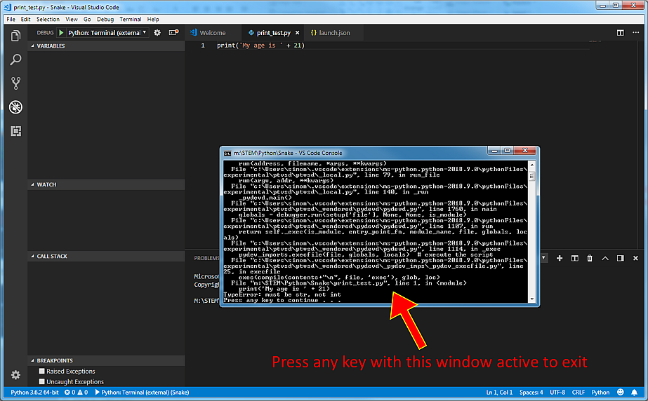

Joining items with `print`
--------------------------
We can use `print` to make a long bit of text from two shorter bits of text by using a plus sign. For example if you change your code to
```
print('Lovely weather' + 'for the time of year')
```
then save it and run it you will see a combined statement. But there's something not right about the output. Can you spot what it is? 

Challenge
=========
How would you make a small change to the code so the output would look right?

Printing numbers
----------------
The code above shows how to output some text. But `print` can also be used to print numbers. Change your code to
```
print(21)
```
and Save it. Now run it by clicking the green arrow. 

`print` can also do calculations. Experiment with this by putting some sums inside the brackets and save and run the code and see if the results match what you expected. For example
```
print(3+4*5)
```
But beware! If you are using a plus sign to join items one thing you 
*can't* do with `print` is mix text and numbers in one statement. Change your code to
```
print('My age is ' + 21)
```
then save it and run it. Notice that the small black window immediately fills up with text, which is what happens when there is an error in the code. In this case the key words are in the second last line which says "TypeError: must be str, not int".



To exit from this error, press any key.

In your code the `print` function has a part in quotes, which is text, known in Python as data type *string* but the other part is a number, in fact a whole number, or data type *integer*. The `print` function can't mix these two. We can avoid the error by changing the number from type *integer* to type *string*. The Python way to do this is to place the number to be converted inside brackets and put the letters str before the brackets. To convert the number 21 to type string we would use `str(21)` The revised code will be
```
print('My age is ' + str(21))
```
and if you save and run this code it will not produce an error. (Make sure your code has two brackets after the number 21.)

However, there is another way of joining items in a `print` function, which is to separate the items with a comma - for example 
```
print('Lovely weather', 'for the time of year')
```
If you use the comma option to separate items in a `print` function you *can* combine text and numbers and it will not give an error!
```
print('My age is', 21)
```

Using `print` with variables
----------------------------
`print` can also be used to print variables. Try this code:
```
a = 'Horatio'
print('Good morning, ' + a)
```
`a` is a variable. Because we defined `a` using quotes Python knows this is a *string* variable, so we can use a plus sign inside `print` and it won't give an error. If we made `a` an *integer* variable, for example by changing the first line of code to `a = 21`, then the print function would give an error like the one above. To avoid this error we would have to convert the variable `a` to data type *string* using `str(a)`.

[Go to Week 2 - Lists and Loops](../../Week2-Lists_and_Loops)