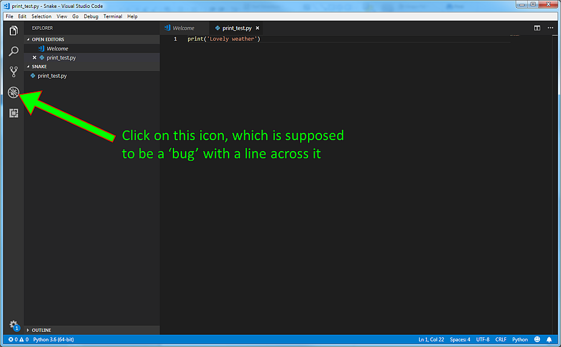

To explore lists and loops we will write Python code which doesn't need to run with Pygame Zero. Instead we will run the code inside Visual Studio Code using the Debugging feature. There are some steps needed to set up this in Visual Studio Code.

Make sure you open Visual Studio Code using File>Open Folder, and choose the new Snake folder.

Now go to File>New File. This will open a new tab, probably called Untitled-1.

Now use File>Save As and give this a name, for example, print_test.py. MAKE SURE in the box labelled Save as type: you scroll down the list to type Python.

In this file put a single Python print statement, which includes some text inside quotes. In this example the statement is 
```
print('Lovely weather')
```

Now click the Debug symbol



After a pause, which might involve downloading some files, you will see this:
