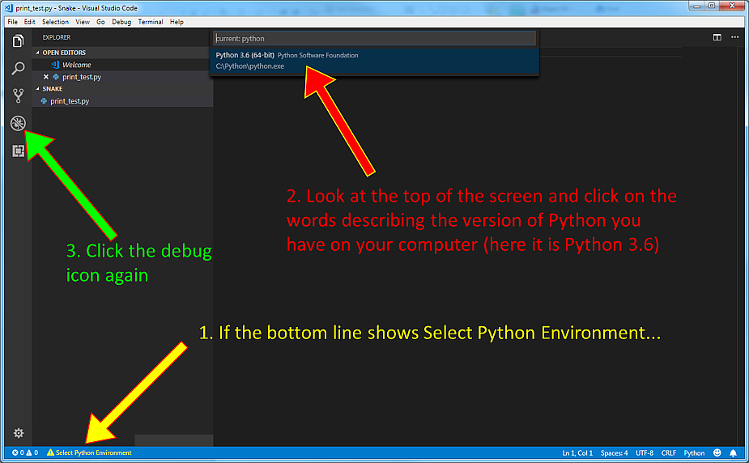
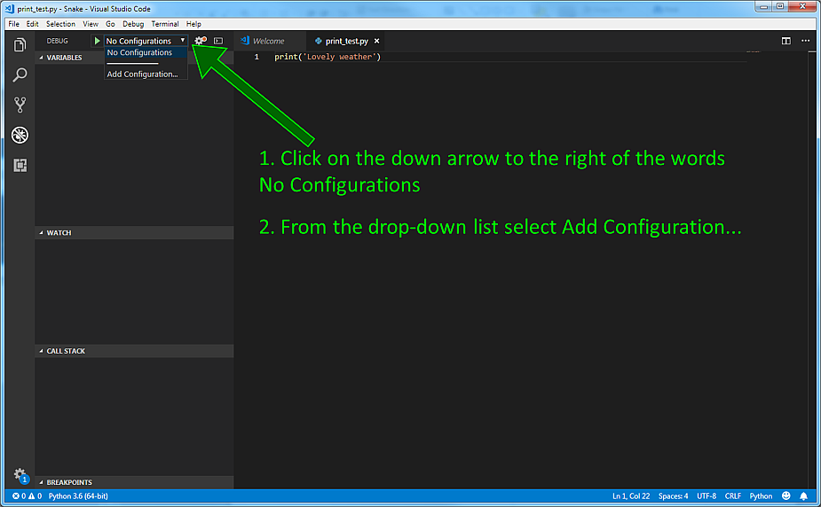
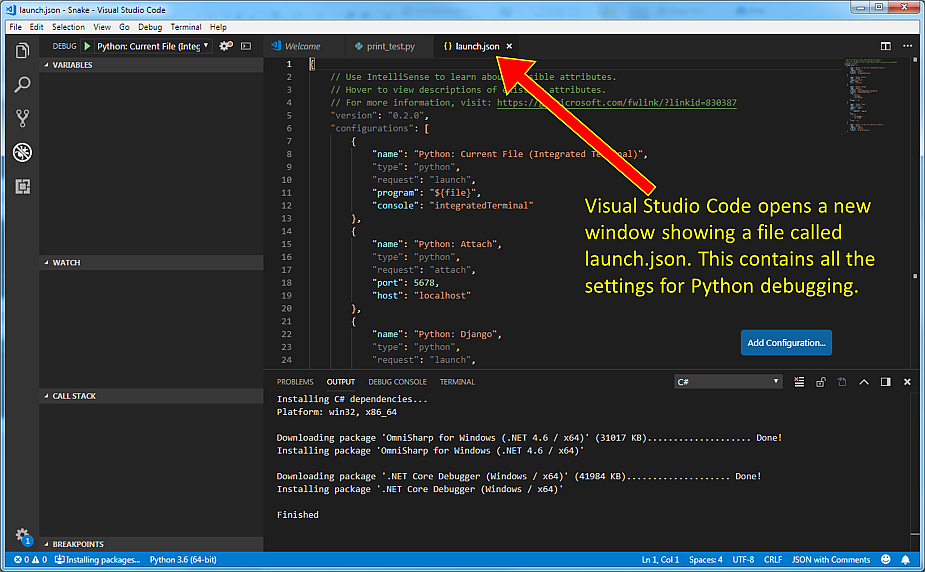
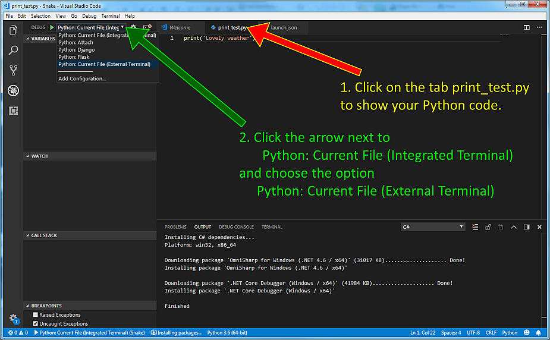

To explore lists and loops we will write Python code which doesn't need to run with Pygame Zero. Instead we will run the code inside Visual Studio Code using the Debugging feature. There are some steps needed to set up this in Visual Studio Code.

Make sure you open Visual Studio Code using File>Open Folder, and choose the new Snake folder.

Now go to File>New File. This will open a new tab, probably called Untitled-1.

Now use File>Save As and give this a name, for example, print_test.py. MAKE SURE in the box labelled Save as type: you scroll down the list to type Python.

In this file put a single Python print statement, which includes some text inside quotes. In this example the statement is 
```
print('Lovely weather')
```

Now click the Debug symbol


At this point you might see the text in the bar along the bottom of the Visual Studio Code window turn yellow and show a message which says Select Python Environment. If so, follow the three steps on this picture. If the text along the bottom bar already says something like Python 3.6 (64-bit) then you can skip this step.



Look for the words No Configurations at the top left of the Visual Studio Code window and follow the steps in the next picture.



After you click Add configuration there may be a pause while the Output pane at the bottom shows some packages being downloaded. Finally Visual Studio Code will open a new file called launch.json as in the next picture.



Now click the tab for the file print_test.py so you can see your code. Then click the down arrow next to Python: Current File (Integrated Terminal) and from the list choose the option Python: Current File (External Terminal) as in the next picture.



