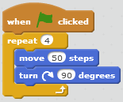

To continue with the Snake project we need to learn about lists.

Lists
-----

A List in Python is simply a collection of different items, they can be numbers, or bits of text, or other things. To make them into a list you simply put all the items inside square brackets, then put a comma in between each of the items. Here is an example of a Python list:
```
['apple', 'orange', 'pear', 'strawberry', 'banana']
```
This is a list of text items - you can tell they are text items because each of the items is contained in quotes. Here is a list containing numbers:
```
[1,2,3,4,5,6,7,8,9,10]
```
Python also has a special type of variable is called a *List* variable, which contains a list. To make a List variable you simply set the variable equal to a list. Here is the code to make a list variable called `myfruitslist` which contains a list of fruits:
```
myfruitslist = ['apple', 'orange', 'pear', 'strawberry', 'banana']
```
You can use the Python print function to see what the list variable contains:
```
myfruitslist = ['apple', 'orange', 'pear', 'strawberry', 'banana']
print(myfruitslist)
```
You can also look at individual items in the list by using the list variable name, followed by a number in square brackets. Try this code, but **put a number inside the square brackets instead of the question mark** to print the *third* item in the list:
```
myfruitslist = ['apple', 'orange', 'pear', 'strawberry', 'banana']
print(myfruitslist[?])
```
Click on the green arrow to run the code. Did it print the item you were expecting?

When using Python lists it's important to remember that the first item in the list is item 0, and the next item item 1 etc. Change your code, if necessary, to make sure Python prints out the word pear.

Loops
-----

If you've done coding with Scratch you may know about the Repeat block, which is used when you want to repeat a bit of code a fixed number of  times.



In Python, the way to repeat some code, when you know exactly how many times you want to repeat it, is with a `for` loop. A `for` loop uses a *variable* as an index, and a *List* to control how many times the loop repeats.

Here is a typical Python `for` loop:
```
for n in [1,2,3,4,5]:
    print(n)
```

In this example `n` is the index variable, and `[1,2,3,4,5]` is the list which controls the repetition. Notice also that there is a colon at the end of the line which begins with `for` and that all the lines which you want to be repeated are *INDENTED*. Here's how it works:

* The first time through the loop Python sets the index variable to the value of the first item in the list, so in this example it sets `n = 1`. Python then carries out all the instructions which are indented - in this example it will print the number 1.
* Python goes back to the top of the loop and sets the index variable to the value of the second item in the list, then carries out the indented instructions.
* Python keeps going back to the top of the loop, setting the index variable to the value of the next item in the list and carrying out the indented instructions until it has got to the end of the list and used up all the items. Then it stops, or goes on to carry out more instructions if there are any. (In this example there aren't any more instructions.)

Challenge
=========


 - write a programme to print out a 3 times table using for and a list.

It's easy to type a number list if you only want a few numbers in it, but if you wanted a number list which went from 0 up to 100 or more it would be very tedious to type out all the numbers by hand. Luckily Python has a command which will generate an automatic number list - it's called the range function. 

There are three ways you can use the range function - and the best way to find out about them is to try them out.

range function - first method:

numberlist = range(9)

Here range will generate an automatic number list, but to see what this list looks like we have to use print but with an extra command. If we type print(numberlist) Python will simply print range(9) which isn't very helpful. If we want to see the numbers which are in the automatically generated list we need to use

print(list(numberlist))

If you run the code it will show the numbers in the list. What do you notice about these numbers? How would you use range to produce a list which went from 0 to 17? Try it and see if it works!

range function - second method:

numberlist = range(2,11)

Here we have put two numbers in brackets after range, separated by a comma. Use the same print command to see which numbers go into the number list with this command. 
 
range function - third method:

numberlist = range(4,21,3)

Here we have put three numbers in brackets after range, separated by commas. Use the same print command to see which numbers go into the number list with this command. 
 